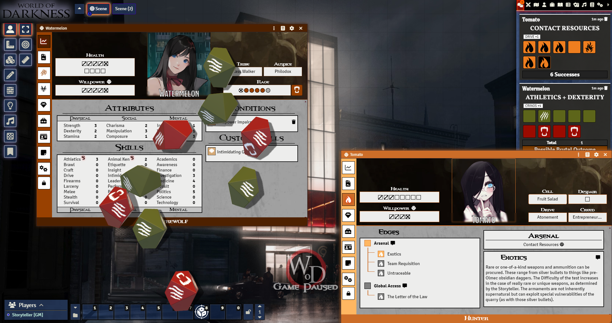

# World of Darkness 5e System

[![Foundry Version Support]][System URL]
[![GNU GPL v3 License]][License URL]
[![GitHub Super-Linter]][Super-Linter URL]

This system is for playing multiple World of Darkness 5th edition systems on the Foundry Virtual Tabletop System. For a list of the latest changes, see the [Changelog](https://github.com/WoD5E-Developers/wod5e/releases). You can also read further about the system in general on the [WOD5E Documentation](https://wod5e-developers.github.io/) site!

Current supported systems include:
* Vampire the Masquerade, 5th Edition
* Hunter the Reckoning, 5th Edition
* Werewolf the Apocalypse, 5th Edition

## Dice

To roll the splat-unique dice, replace the usual roll formula like so:
* To roll Vampire dice, roll `1dv`. To roll Hunger dice, roll `1dg`.
* To roll Hunter dice, roll `1dh`. To roll Desperation dice, roll `1ds`.
* To roll Werewolf dice, roll `1dw`. To roll Rage dice, roll `1dr`.

Replace the 1s with however many you want to roll for each type, and let the dice roll! We also have compatibility with the [Dice So Nice!](https://foundryvtt.com/packages/dice-so-nice/) module, so whenever you roll splat dice you'll get the World of Darkness 5th edition symbols on the 3D dice faces.

## Feedback

Bugs or feature requests created to this repository are greatly appreciate. Please use the [Issues](https://github.com/WoD5E-Developers/wod5e/issues) page for these!

You can also reach out to Veilza on Discord, or leave a message in the #wod channel in the official Foundry Discord server, with any issues. We'd love to help you get your game running smoothly!

Please check the issues list before suggesting new features.

## Contributors & Contributing

The lead system developer is [Veilza](https://github.com/Veilza), and the original creator of the system is [Rayji96](https://github.com/Rayji96).

There's lots of other people who contribute to the system, too, and you can find the full list of them down [here](https://github.com/WoD5E-Developers/.github/blob/main/contributors.md)!

If you'd like to help contribute too, just open a pull request any time!

If you'd like to help contribute localization updates, you can either open up an issue with the "Localization" issue type, or you can do a pull request with updates as needed.

## Dark Pack

[![Dark Pack]][Dark Pack URL]

Licensed WoD 5e materials will not be provided as this system is provided for public usage, for free. We have made every effort to keep the Dark Pack guidelines as posted at [Dark Pack Agreement].

# System License

World of Darkness 5e System for Foundry VTT
Copyright (C) 2024, World of Darkness 5e Developers

This program is free software: you can redistribute it and/or modify
it under the terms of the GNU General Public License as published by
the Free Software Foundation, either version 3 of the License, or
(at your option) any later version.

This program is distributed in the hope that it will be useful,
but WITHOUT ANY WARRANTY; without even the implied warranty of
MERCHANTABILITY or FITNESS FOR A PARTICULAR PURPOSE.  See the
GNU General Public License for more details.

You should have received a copy of the GNU General Public License
along with this program.  If not, see <https://www.gnu.org/licenses/>.

[Foundry Version Support]: https://img.shields.io/endpoint?url=https%3A%2F%2Ffoundryshields.com%2Fversion%3Fstyle%3Dplastic%26url%3Dhttps%3A%2F%2Fgithub.com%2FWoD5E-Developers%2Fwod5e%2Freleases%2Flatest%2Fdownload%2Fsystem.json
[System URL]: https://foundryvtt.com/packages/vtm5e/

[GNU GPL v3 License]: https://img.shields.io/badge/License-GNU_GPL_v3-green
[License URL]: ./LICENSE.md

[GitHub Super-Linter]: https://github.com/WoD5E-Developers/wod5e/workflows/Super-Linter/badge.svg
[Super-Linter URL]: https://github.com/marketplace/actions/super-linter

[Dark Pack]: https://s3-eu-north-1.amazonaws.com/pdx-campaign-wp-data/uploads/sites/10/2021/10/05102936/darkpack_logo2-300x300.png
[Dark Pack URL]: https://www.paradoxinteractive.com/games/world-of-darkness/community/dark-pack-agreement
[Dark Pack Agreement]: https://www.paradoxinteractive.com/games/world-of-darkness/community/dark-pack-agreement
